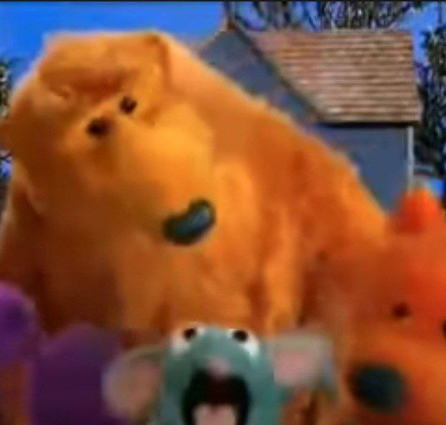
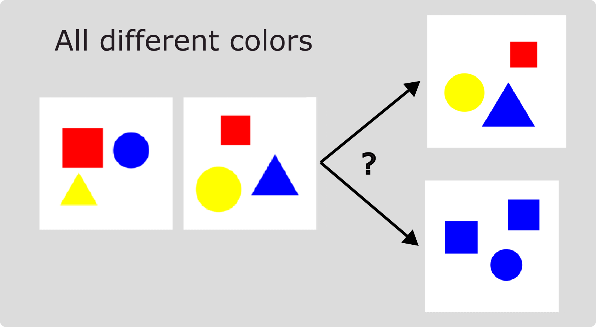

# BEARS Make Neuro-Symbolic Models Aware of their Reasoning Shortcuts

Codebase for the paper: 

BEARS Make Neuro-Symbolic Models Aware of their Reasoning Shortcuts, E. Marconato, S. Bortolotti, E. van Krieken, A. Vergari, A. Passerini, S. Teso

[](https://arxiv.org/abs/2402.12240)

```
@misc{marconato2024bears,
      title={BEARS Make Neuro-Symbolic Models Aware of their Reasoning Shortcuts}, 
      author={Emanuele Marconato and Samuele Bortolotti and Emile van Krieken and Antonio Vergari and Andrea Passerini and Stefano Teso},
      year={2024},
      eprint={2402.12240},
      archivePrefix={arXiv},
      primaryClass={cs.LG}
}
```

If you find the code useful, please consider citing it.

[](https://github.com/samuelebortolotti/bears/blob/master/CITATION.cff)


<p text-align="center" style="display: block; margin-left: auto; margin-right: auto; width: 40%;">Welcome, welcome, welcome <br>
To the <a href="https://en.wikipedia.org/wiki/Bear_in_the_Big_Blue_House">big blue house</a> <br>
Door is open come on in <br>
Now you're here <br>
So lets... begin
</p>

## Abstract

Neuro-Symbolic (NeSy) predictors that conform to symbolic knowledge - encoding, e.g., safety constraints - can be affected by Reasoning Shortcuts (RSs): They learn concepts consistent with the symbolic knowledge by exploiting unintended semantics. RSs compromise reliability and generalization and, as we show in this paper, they are linked to NeSy models being overconfident about the predicted concepts. Unfortunately, the only trustworthy mitigation strategy requires collecting costly dense supervision over the concepts. Rather than attempting to avoid RSs altogether, we propose to ensure NeSy models are aware of the semantic ambiguity of the concepts they learn, thus enabling their users to identify and distrust low-quality concepts. Starting from three simple desiderata, we derive bears (BE Aware of Reasoning Shortcuts), an ensembling technique that calibrates the model's concept-level confidence without compromising prediction accuracy, thus encouraging NeSy architectures to be uncertain about concepts affected by RSs. We show empirically that bears improves RS-awareness of several state-of-the-art NeSy models, and also facilitates acquiring informative dense annotations for mitigation purposes. 

## Installation and use

To run experiments on XOR, MNIST-Addition, Kandinsky and BDD-OIA, access the linux terminal and use the conda installation followed by pip3:

```
$conda env create -n rs python=3.8
$conda activate rs
$pip install -r requirements.txt
```

## BDD-OIA (2048)

BDD-OIA is a dataset of dashcams images for autonomous driving predictions, annotated with input-level objects (like bounding boxes of pedestrians, etc.) and concept-level entities (like "road is clear"). The original dataset can be found here: https://twizwei.github.io/bddoia_project/

The dataset is preprocessed with a pretrained Faster-RCNN on BDD-100k and with the first module in CBM-AUC (Sawada and Nakamura, IEEE (2022)), leading to embeddings of dimension 2048. These are reported in the zip ```bdd_2048.zip```. The original repo of CBM-AUC can be found here https://github.com/AISIN-TRC/CBM-AUC.


For usage, consider citing the original dataset creators and Sawada and Nakamura:

```
@InProceedings{xu2020cvpr,
author = {Xu, Yiran and Yang, Xiaoyin and Gong, Lihang and Lin, Hsuan-Chu and Wu, Tz-Ying and Li, Yunsheng and Vasconcelos, Nuno},
title = {Explainable Object-Induced Action Decision for Autonomous Vehicles},
booktitle = {IEEE/CVF Conference on Computer Vision and Pattern Recognition (CVPR)},
month = {June},
year = {2020}}

@ARTICLE{sawada2022cbm-auc,
  author={Sawada, Yoshihide and Nakamura, Keigo},
  journal={IEEE Access}, 
  title={Concept Bottleneck Model With Additional Unsupervised Concepts}, 
  year={2022},
  volume={10},
  number={},
  pages={41758-41765},
  doi={10.1109/ACCESS.2022.3167702}}
```

## MNIST

This repository comprises several MNIST variations. The most relevant ones are:

**MNIST-Even-Odd:**

The MNIST-Even-Odd dataset is a variant of MNIST-Addition introduced by Marconato et al. (2023b). It consists of specific combinations of digits, including only even or odd digits, such as 0+6=6, 2+8=10, and 1+5=6. The dataset comprises 6720 fully annotated samples in the training set, 1920 samples in the validation set, and 960 samples in the in-distribution test set. Additionally, there are 5040 samples in the out-of-distribution test dataset, covering all other sums not observed during training. The dataset is associated with reasoning shortcuts, and the number of deterministic RSs was calculated to be 49 by solving a linear system.

**MNIST-Half:**

MNIST-Half is a biased version of MNIST-Addition, focusing on digits ranging from 0 to 4. Selected digit combinations include 0+0=0, 0+1=1, 2+3=5, and 2+4=6. Unlike MNIST-Even-Odd, two digits (0 and 1) are not affected by reasoning shortcuts, while 2, 3, and 4 can be predicted differently. The dataset comprises 2940 fully annotated samples in the training set, 840 samples in the validation set, and 420 samples in the test set. Additionally, there are 1080 samples in the out-of-distribution test dataset, covering remaining sums with the included digits.

## Kandinksy

The Kandinsky dataset, introduced by Müller and Holzinger in 2021, features visual patterns inspired by the artistic works of Wassily Kandinsky. Each pattern is constructed with geometric figures and encompasses two main concepts: shape and color. The dataset proposes a variant of Kandinsky where each image contains a fixed number of figures, and each figure can have one of three possible colors (red, blue, yellow) and one of three possible shapes (square, circle, triangle).

In an active learning setup, resembling an IQ test for machines, the task involves predicting the pattern of a third image given two images that share a common pattern. During inference, a model, such as the NeSy model mentioned in the experiment, computes a series of predicates like "same_cs" (same color and shape) and "same_ss" (same shape and same color). The model needs to choose the third image that completes the pattern based on these computed predicates. For example, if the first two images have different colors, the model should select the option that aligns with the observed pattern. The dataset provides a challenging task that tests a model's ability to generalize and infer relationships between visual elements.



## Structure of the code

* The code structure is the same as [Marconato Reasoning Shortcuts](https://github.com/ema-marconato/reasoning-shortcuts): XOR, Kandinksy and MNIST-Addition are in single project folder, located in ```XOR_MNIST```. Here, we defined:

    * ``backbones`` contains the architecture of the NNs used.
    * ``datasets`` cointains the various versions of MNIST addition. If you want to add a dataset it has to be located here.
    * ``example`` is an independent folder containing all the experiments and setup for running XOR
    *  ``models`` contains all models used to benchmark the presence of RSs. Here, you can find DPL, SL, and LTN + recunstruction, but also a simple concept extractor (cext.py) and conditional VAEs (cvae.py)
    * ``utils`` contains the training loop, the losses, the metrics and (only wandb) loggers 
    * ``exp_best_args.py`` is where I collected all best hyper-parameters for MNIST-Addition and XOR.
    * you can use ``experiments.py`` to prepare a stack of experiments. If you run on a cluster, you can run ``server.py`` to access submitit and schedule a job array or use ``run_start.sh`` to run a single experiment. 


* ``BDD_OIA`` follows the design of Sawada and can be executed launching ``run_bdd.sh``. Hyperparameters are already set.


* args in ``utils.args.py``:
    * --dataset: choose the dataset
    * --task: addition/product/multiop
    * --model: which model you choose, remember to add rec at end if you want to add reconstruction penalty
    * --c_sup: percentage of concept supervision. If zero, then 0% of examples are supervise, if 1, then 100% of examples have concept supervision
    * --which_c: pass a list to specify which concepts you want to supervise, e.g. [1,2], will activate supervision for only concept 1 and 2
    * --joint: if included it will process both MNIST digits all together
    * --entropy: if included it will add the entropy penalty
    * --w_sl: weight for the Semantic Loss
    * --gamma: general weight for the mitigation strategy (this will multiply with other weights. My advice is to set it to 1)
    * --wrec, --beta, --w_h, --w_c: different weights for penalties (see also args description)
    * --do-test: activate the test method. Refer to this others arguments to try out all the possible testing operations.

    * others are quite standard, consider using also:
        * --wandb: put here the name of your project, like 'i-dont-like-rss'
        * --checkin, --checkout: specify path were to load and to save checkpoints, respectivey
        * --validate: activate it to use the validation set (this is a switch from val to test)

## Issues report, bug fixes, and pull requests

For all kind of problems do not hesitate to contact me. If you have additional mitigation strategies that you want to include as for others to test, please send me a pull request. 

## Makefile

To see the Makefile functions, simply call the appropriate help command with [GNU/Make](https://www.gnu.org/software/make/)

```bash
make help
```

The `Makefile` provides a simple and convenient way to manage Python virtual environments (see [venv](https://docs.python.org/3/tutorial/venv.html)).

### Environment creation

In order to create the virtual enviroment and install the requirements be sure you have the Python 3.9 (it should work even with more recent versions, however I have tested it only with 3.9)

```bash
make env
source ./venv/reasoning-shortcut/bin/activate
make install
```

Remember to deactivate the virtual enviroment once you have finished dealing with the project

```bash
deactivate
```

### Generate the code documentation

The automatic code documentation is provided [Sphinx v4.5.0](https://www.sphinx-doc.org/en/master/).

In order to have the code documentation available, you need to install the development requirements

```bash
pip install --upgrade pip
pip install -r requirements.dev.txt
```

Since Sphinx commands are quite verbose, I suggest you to employ the following commands using the `Makefile`.

```bash
make doc-layout
make doc
```

The generated documentation will be accessible by opening `docs/build/html/index.html` in your browser, or equivalently by running

```bash
make open-doc
```

However, for the sake of completeness one may want to run the full Sphinx commands listed here.

```bash
sphinx-quickstart docs --sep --no-batchfile --project bears--author "The Reasoning Shortcut Gang"  -r 0.1  --language en --extensions sphinx.ext.autodoc --extensions sphinx.ext.napoleon --extensions sphinx.ext.viewcode --extensions myst_parser
sphinx-apidoc -P -o docs/source .
cd docs; make html
```

## Libraries and extra tools

This code is adapted from [Marconato Reasoning Shortcuts](https://github.com/ema-marconato/reasoning-shortcuts). To implement [PCBMs](https://arxiv.org/abs/2306.01574), we employed some functions from [Kim ProbCBM](https://github.com/ejkim47/prob-cbm).

## Laplace

Since [Laplace](https://github.com/AlexImmer/Laplace) is not meant to deal with a Neuro-Symbolic architecture and neither with multiclass classification problems, we define our [own fork](https://github.com/samuelebortolotti/Laplace-Reasoning-Shortcut) which is expected to work **only** with our networks.

Here we list the steps we performed:

1. Go to `laplace/utils/feature_extractor.py`
2. Add the following line to `find_last_layer`:
  ```python
  if key != 'original_model.encoder.dense_c' and key != 'original_model.conceptizer.enc1':
                continue
  ```
  so that the library takes the concept bottleneck as the Laplace model.

3. Go to `laplace/lllaplace.py`
4. Add the following line to `_nn_predictive_samples`:
  ```python
  self.model.model.model_possibilities = [None] * n_samples
  fs = list()
  for i, sample in enumerate(self.sample(n_samples)):
      vector_to_parameters(sample, self.model.last_layer.parameters())
      self.model.model.model_possibilities[i] = sample
      fs.append(self.model(X.to(self._device)).detach())
  ```
  so that the wrapper model knows to start tracking the output predictions.
  Where the added lines are: `self.model.model.model_possibilities = [None] * n_samples` 
  and `self.model.model.model_possibilities[i] = sample`

Moreover in the file `laplace/curvature/curvature.py` change this:

```python
def BCE_forloop(tar,pred):
    loss = F.binary_cross_entropy(tar[0, :4], pred[0, :4])
    
    for i in range(1,len(tar)):
        loss = loss + F.binary_cross_entropy(tar[i, :4], pred[i, :4])
    return loss 

def CE_forloop(y_pred, y_true):
    y_trues = torch.split(y_true, 1, dim=-1)
    y_preds = torch.split(y_pred, 2, dim=-1)

    loss = 0
    for i in range(4):
        
        true = y_trues[i].view(-1)
        pred = y_preds[i]

        loss_i = F.nll_loss( pred.log(), true.to(torch.long) )
        loss += loss_i / 4

        assert loss_i > 0, pred.log() 
    
    return loss

class CurvatureInterface:
    """Interface to access curvature for a model and corresponding likelihood.
    A `CurvatureInterface` must inherit from this baseclass and implement the
    necessary functions `jacobians`, `full`, `kron`, and `diag`.
    The interface might be extended in the future to account for other curvature
    structures, for example, a block-diagonal one.

    Parameters
    ----------
    model : torch.nn.Module or `laplace.utils.feature_extractor.FeatureExtractor`
        torch model (neural network)
    likelihood : {'classification', 'regression'}
    last_layer : bool, default=False
        only consider curvature of last layer
    subnetwork_indices : torch.Tensor, default=None
        indices of the vectorized model parameters that define the subnetwork
        to apply the Laplace approximation over

    Attributes
    ----------
    lossfunc : torch.nn.MSELoss or torch.nn.CrossEntropyLoss
    factor : float
        conversion factor between torch losses and base likelihoods
        For example, \\(\\frac{1}{2}\\) to get to \\(\\mathcal{N}(f, 1)\\) from MSELoss.
    """
    def __init__(self, model, likelihood, last_layer=False, subnetwork_indices=None):
        assert likelihood in ['regression', 'classification']
        self.likelihood = likelihood
        self.model = model
        self.last_layer = last_layer
        self.subnetwork_indices = subnetwork_indices
        if likelihood == 'regression':
            self.lossfunc = MSELoss(reduction='sum')
            self.factor = 0.5
        else:
            self.lossfunc = CrossEntropyLoss(reduction='sum')
            # self.lossfunc = CE_forloop
            self.factor = 1.
```

where for MNIST `self.lossfunc = CrossEntropyLoss(reduction='sum')` and for BDD `self.lossfunc = CE_forloop`

## Acknowledgements

The authors are grateful to Zhe Zeng for useful discussion. Funded by the European Union. Views and opinions expressed are however those of the author(s) only and do not necessarily reflect those of the European Union or the European Health and Digital Executive Agency (HaDEA). Neither the European Union nor the granting authority can be held responsible for them. Grant Agreement no. 101120763 - TANGO. AV is supported by the "UNREAL: Unified Reasoning Layer for Trustworthy ML" project (EP/Y023838/1) selected by the ERC and funded by UKRI EPSRC.
